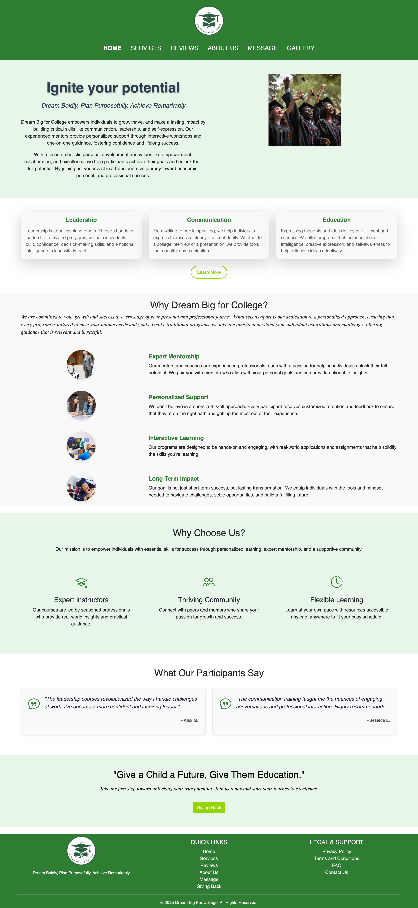
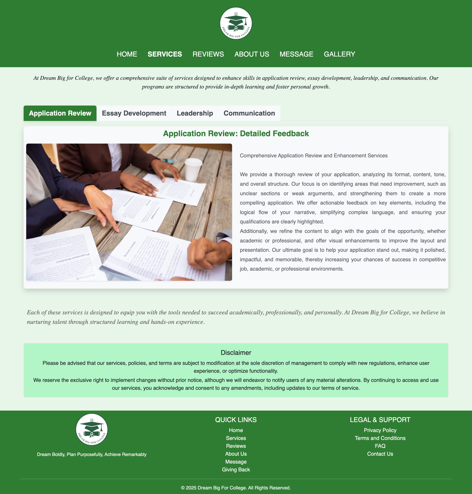
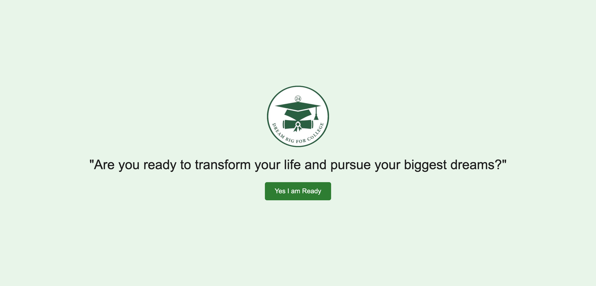
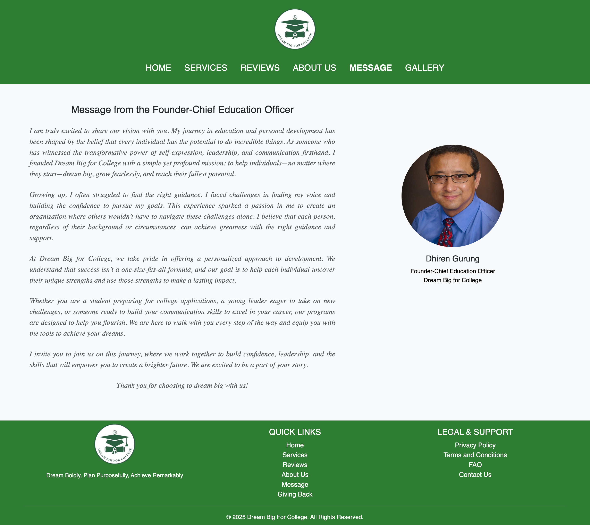

# Dream Big For College

Welcome to the **Dream Big For College** project! This web application is designed to empower individuals through education, leadership, and communication. Our platform provides various resources, courses, and community support to help participants grow personally and professionally.

## Table of Contents
- [Features](#features)
- [Services](#services)
- [Technologies Used](#technologies-used)
- [Getting Started](#getting-started)
- [Contributing](#contributing)
- [License](#license)

## Features
- **User Registration and Login**: Secure authentication system allowing users to register and log in.
- **Course Offerings**: Access a variety of courses focusing on education, leadership, and communication skills.
- **Testimonials**: Read experiences from past participants to understand the impact of our programs.
- **Responsive Design**: Fully responsive layout that works seamlessly on both desktop and mobile devices.
- **Modern UI/UX**: A user-friendly interface that enhances the learning experience.

## Services
### Our Services Include:
1. **Education**:
   - Explore resources and courses designed to enhance knowledge, from foundational topics to advanced certifications.
   - Workshops and seminars that focus on various educational strategies.

2. **Leadership**:
   - Develop leadership skills to inspire and lead effectively in various environments.
   - Interactive sessions that encourage practical application of leadership principles.

3. **Communication**:
   - Enhance interpersonal skills through targeted communication training.
   - Programs designed to improve listening and speaking abilities for better relationship building.

## Technologies Used
- **Frontend**: HTML5, CSS3, Bootstrap 5, JavaScript, jQuery
- **Backend**: PHP, MySQL
- **Libraries**: Bootstrap Icons for enhanced visual appeal
- **Tools**: AJAX for seamless user interaction without page reloads

## Screenshots of web pages

## 1. Homepage

## 2. About Us Page

## 3. Services Page

## 4. Contact Us Page

## 5. Landing Page

## 6. Review Page

## 7. Message Page

## 8. Gallery Page

---